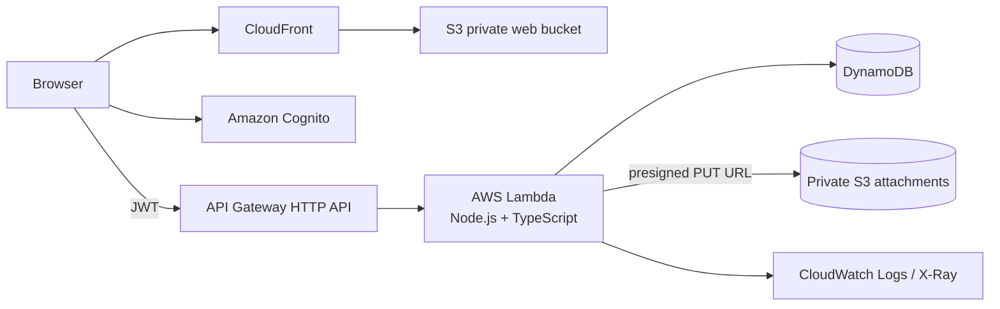

# PulseOps Serverless

A production-minded serverless incident and service-request platform built to demonstrate full-stack TypeScript and AWS architecture.

PulseOps lets authenticated users report incidents, track status and priority, collaborate through comments, and upload evidence. Members of the Cognito `Agents` and `Admins` groups can operate across all incidents while regular users remain scoped to incidents they created.

## Architecture



## Stack

- **Frontend:** React 19, TypeScript, Vite, React Router
- **Authentication:** Amazon Cognito User Pool + JWT authorizer
- **API:** Amazon API Gateway HTTP API
- **Compute:** AWS Lambda on `nodejs22.x`
- **Database:** DynamoDB single-table model with two GSIs
- **Files:** private Amazon S3 with short-lived presigned upload URLs
- **Delivery:** private S3 origin behind CloudFront OAC
- **Infrastructure as Code:** AWS SAM / CloudFormation
- **Validation:** Zod
- **AWS SDK:** JavaScript SDK v3
- **Testing:** Vitest

## Product capabilities

- Email/password registration and email confirmation through Cognito
- Protected routes and JWT-authenticated API requests
- Create, read, update, filter, and delete incidents
- Priorities: low, medium, high, critical
- Workflow: open, in progress, resolved, closed
- User-level resource isolation
- `Agents` / `Admins` group-based operational access
- Dashboard summary and recent incidents
- Incident comments
- Direct-to-S3 attachments using presigned URLs
- Structured Lambda logs and X-Ray tracing
- Consistent API error envelopes
- Responsive UI for desktop and mobile

## Repository structure

```text
pulseops-serverless/
├── apps/
│   └── web/                  # React + Vite frontend
├── services/
│   └── api/                  # Lambda handlers, domain logic and tests
├── infra/
│   └── template.yaml         # SAM / CloudFormation infrastructure
├── scripts/
│   ├── deploy-infra.sh
│   ├── deploy-web.sh
│   └── destroy.sh
└── package.json              # npm workspaces
```

## API

| Method | Route | Auth | Purpose |
|---|---|---:|---|
| GET | `/health` | No | Health check |
| GET | `/dashboard` | Yes | Incident summary |
| GET | `/incidents` | Yes | List accessible incidents |
| POST | `/incidents` | Yes | Create an incident |
| GET | `/incidents/{id}` | Yes | Incident details |
| PATCH | `/incidents/{id}` | Yes | Update incident |
| DELETE | `/incidents/{id}` | Yes | Delete incident and comments |
| GET | `/incidents/{id}/comments` | Yes | List comments |
| POST | `/incidents/{id}/comments` | Yes | Add comment |
| POST | `/incidents/{id}/attachments/presign` | Yes | Create a presigned S3 upload URL |

## DynamoDB access model

The table uses `PK` + `SK` as its primary key.

### Incident

```text
PK      = INCIDENT#<incidentId>
SK      = META
GSI1PK  = USER#<creatorSub>
GSI1SK  = INCIDENT#<createdAt>#<incidentId>
GSI2PK  = INCIDENTS
GSI2SK  = STATUS#<status>#<createdAt>#<incidentId>
```

### Comment

```text
PK = INCIDENT#<incidentId>
SK = COMMENT#<createdAt>#<commentId>
```

`GSI1` supports a user's incident list. `GSI2` supports cross-user operational views and status filtering for agents/admins without a table scan.

## Security decisions

- API Gateway validates Cognito JWTs before protected Lambdas are invoked.
- The backend derives the current user from the validated JWT `sub`; it never trusts a client-supplied user ID.
- Regular users can only access incidents they created.
- Agent/admin capabilities come from Cognito groups, not frontend state.
- S3 buckets block all public access.
- CloudFront reads the web bucket through Origin Access Control.
- Attachment URLs expire after 10 minutes and the API restricts accepted MIME types.
- DynamoDB point-in-time recovery and server-side encryption are enabled.

## Prerequisites

- Node.js 22+
- npm 10+
- AWS CLI authenticated to your AWS account
- AWS SAM CLI

## Install and validate

```bash
npm install
npm run typecheck
npm test
npm run build
```

## Deploy AWS infrastructure

```bash
AWS_REGION=us-east-1 STACK_NAME=pulseops ./scripts/deploy-infra.sh
```

The stack creates Cognito, API Gateway, Lambda, DynamoDB, two private S3 buckets, CloudFront and the required IAM policies.

## Deploy the React application

After infrastructure deployment:

```bash
AWS_REGION=us-east-1 STACK_NAME=pulseops ./scripts/deploy-web.sh
```

The script reads the API URL and Cognito IDs from CloudFormation outputs, injects them into the Vite build, syncs the build to S3 and invalidates CloudFront.

## Run the frontend locally against a deployed development stack

Copy the example environment file:

```bash
cp apps/web/.env.example apps/web/.env.local
```

Fill it with the stack outputs and run:

```bash
npm run dev
```

## Give a user agent/admin access

New registrations are standard users by default. To give an existing user operational access:

```bash
aws cognito-idp admin-add-user-to-group \
  --user-pool-id <USER_POOL_ID> \
  --username <USER_EMAIL> \
  --group-name Agents
```

Use `Admins` instead of `Agents` for the admin group. The user should sign out and sign in again so Cognito issues a token containing the updated group claim.

## Destroy the environment

The S3 buckets must be empty before CloudFormation can delete them. The teardown script handles that first:

```bash
AWS_REGION=us-east-1 STACK_NAME=pulseops ./scripts/destroy.sh
```

## Error contract

API failures use one predictable shape:

```json
{
  "error": {
    "code": "VALIDATION_ERROR",
    "message": "Request validation failed",
    "details": []
  },
  "requestId": "..."
}
```

Unexpected exceptions are logged server-side without exposing stack traces to the browser.

## Engineering trade-offs

PulseOps deliberately stays serverless and stateless. DynamoDB is modeled from access patterns rather than relational normalization, attachments bypass Lambda to avoid sending binary payloads through the API, and API Gateway owns JWT verification. These choices keep the execution path small while making authorization boundaries explicit.

For a larger production system, the next evolution would be event-driven notifications (EventBridge/SNS), persisted attachment metadata, audit events, tenant isolation, OpenTelemetry dashboards, contract/integration tests, and custom-domain/WAF configuration.

## License

MIT
